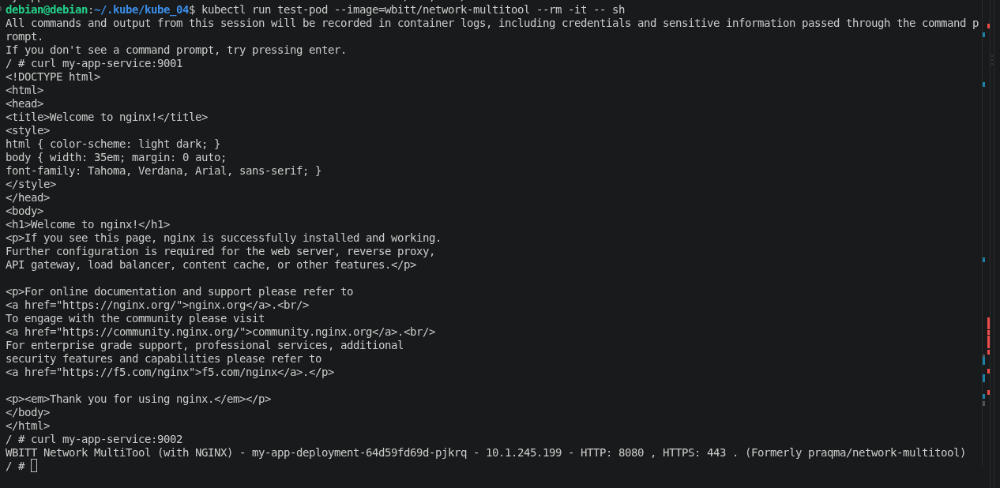
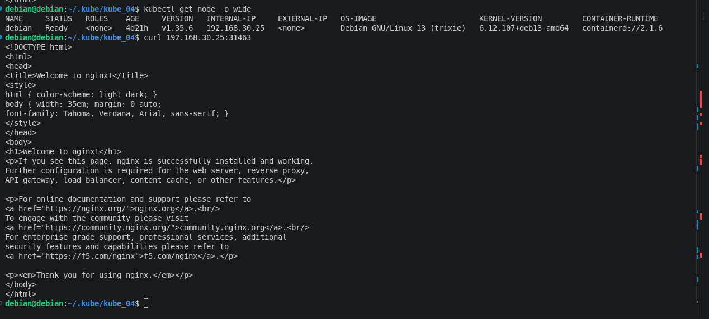
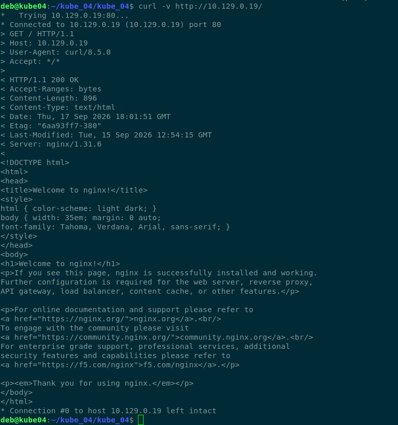
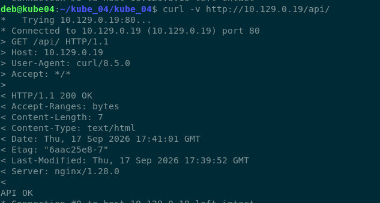
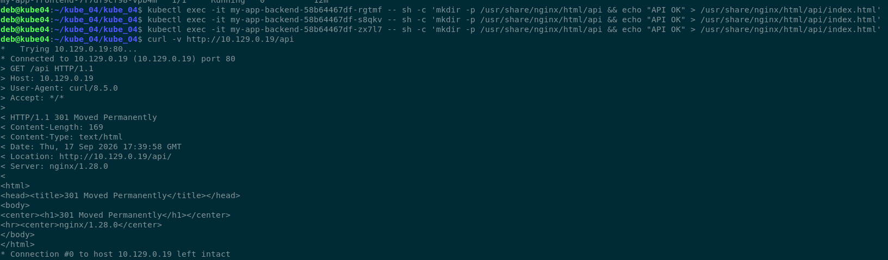

# Домашнее задание: Сетевое взаимодействие в Kubernetes

## Задание 1: Настройка Service (ClusterIP и NodePort)

### Манифесты

**[deploy_task1.yaml](https://github.com/ufilin/kube_04/blob/main/deploy_task1.yaml)**

**[serv_cluster_task1.yaml](https://github.com/ufilin/kube_04/blob/main/serv_cluster_task1.yaml)**

**[serv_node_task1.yaml](https://github.com/ufilin/kube_04/blob/main/serv_node_task1.yaml)**

### Проверка изнутри кластера (ClusterIP)

  

### Проверка снаружи кластера (NodePort)

  

---

## Задание 2: Настройка Ingress

### Манифесты

**[deploy_frontend_task2.yaml](https://github.com/ufilin/kube_04/blob/main/deploy_frontend_task2.yaml)**

**[deploy_backend_task2.yaml](https://github.com/ufilin/kube_04/blob/main/deploy_backend_task2.yaml)**

**[serv_frontend_task2.yaml](https://github.com/ufilin/kube_04/blob/main/serv_frontend_task2.yaml)**

**[serv_backend_task2.yaml](https://github.com/ufilin/kube_04/blob/main/serv_backend_task2.yaml)**

**[ingress_task2.yaml](https://github.com/ufilin/kube_03/blob/main/ingress_task2.yaml)**

### Проверка доступности

**Результат:** `200 OK` — страница "Welcome to nginx!" (frontend).

  

**Результат:** редирект `/api` → `/api/`

  

Для того чтобы не получить 404, создана страница /api внутри подов

  

---

## Использованное окружение

- ОС: Ubuntu 24.04
- Kubernetes: MicroK8s (аддоны: `dns`, `helm3`, `ingress`, `dashboard`)
- Ingress-контроллер: Traefik v3.6.2 (`IngressClass: public`)
- CNI: Calico
